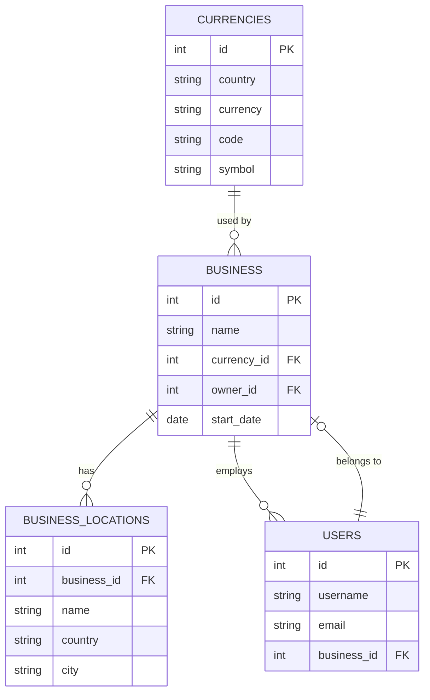
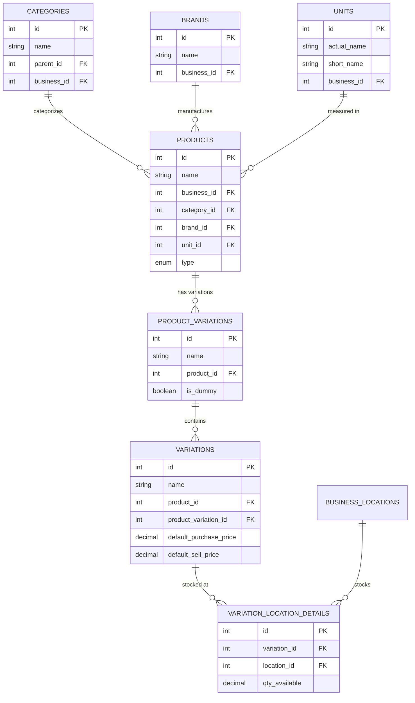
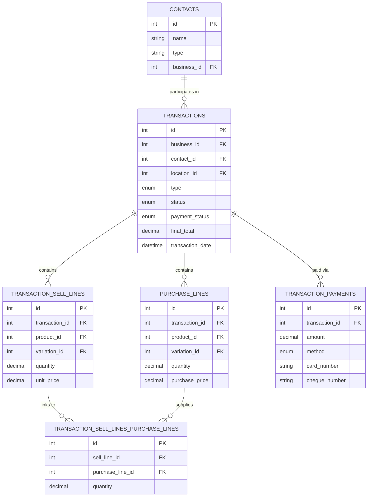
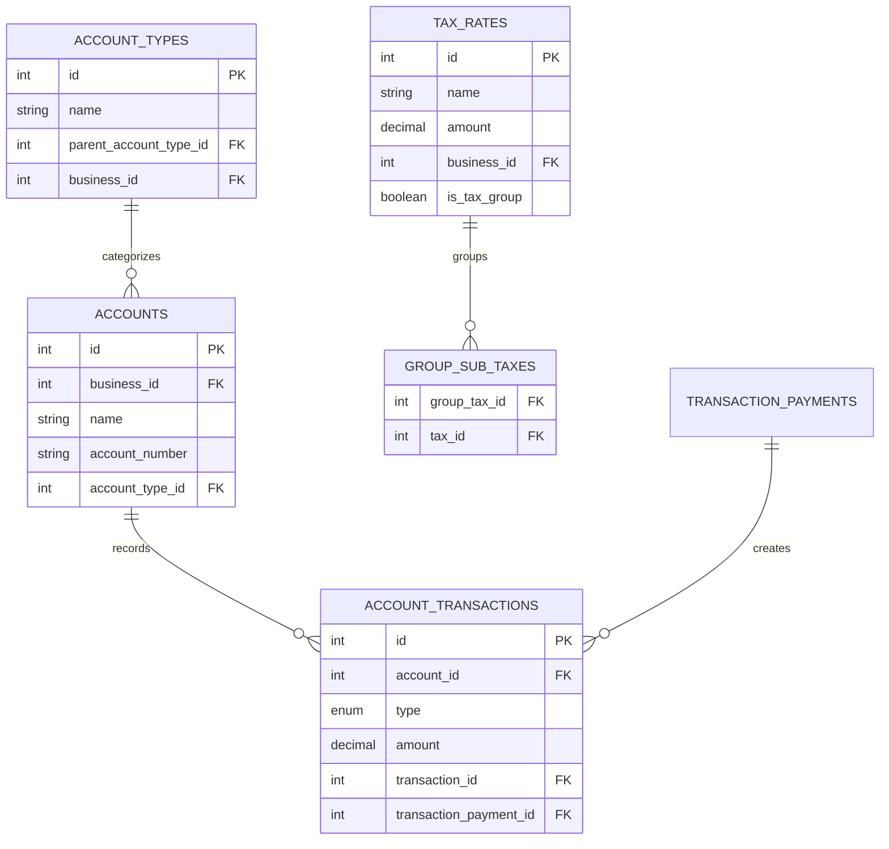
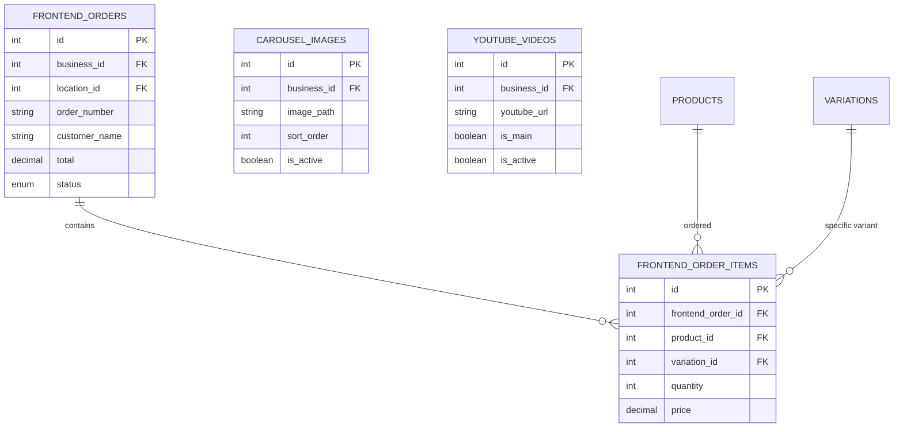

# POS System Database Overview & Entity Relationship Documentation

## Table of Contents
1. [System Architecture](#system-architecture)
2. [Core Entity Relationships](#core-entity-relationships)
3. [Foreign Key Mapping](#foreign-key-mapping)
4. [Entity Relationship Diagrams](#entity-relationship-diagrams)
5. [Table Details with Relationships](#table-details-with-relationships)
6. [Data Flow Patterns](#data-flow-patterns)

---

## System Architecture

### Multi-Tenant Architecture
This POS system is designed with a **multi-business, multi-location** architecture:

```
Business (Root Entity)
├── Business Locations (Multiple per business)
├── Users (Scoped to business)
├── Products (Scoped to business)
├── Transactions (Scoped to business)
├── Settings & Configurations (Scoped to business)
└── All other entities inherit business context
```

### Core Design Principles
1. **Business Isolation**: Every major entity is tied to a business_id
2. **Location-Based Inventory**: Stock levels are maintained per location
3. **Variation Support**: Products can have multiple variations (size, color, etc.)
4. **Financial Tracking**: Comprehensive accounting with accounts and transactions
5. **Role-Based Access**: Permissions and roles scoped to business

---

## Core Entity Relationships

### 1. Business & Multi-Tenancy Layer



### 2. Product Hierarchy & Variations



### 3. Transaction & Sales Flow



### 4. Financial & Accounting Layer



### 5. E-commerce & Frontend Integration



---

## Foreign Key Mapping

### Primary Business Relationships

| Parent Table | Child Table | Foreign Key | Relationship Type | Cascade |
|--------------|-------------|-------------|-------------------|---------|
| `business` | `users` | `business_id` | One-to-Many | CASCADE |
| `business` | `business_locations` | `business_id` | One-to-Many | CASCADE |
| `business` | `products` | `business_id` | One-to-Many | CASCADE |
| `business` | `contacts` | `business_id` | One-to-Many | CASCADE |
| `business` | `transactions` | `business_id` | One-to-Many | CASCADE |
| `business` | `brands` | `business_id` | One-to-Many | CASCADE |
| `business` | `categories` | `business_id` | One-to-Many | CASCADE |
| `business` | `units` | `business_id` | One-to-Many | CASCADE |
| `business` | `tax_rates` | `business_id` | One-to-Many | CASCADE |

### Product & Variation Relationships

| Parent Table | Child Table | Foreign Key | Relationship Type | Cascade |
|--------------|-------------|-------------|-------------------|---------|
| `products` | `product_variations` | `product_id` | One-to-Many | CASCADE |
| `product_variations` | `variations` | `product_variation_id` | One-to-Many | CASCADE |
| `products` | `variations` | `product_id` | One-to-Many | CASCADE |
| `variations` | `variation_location_details` | `variation_id` | One-to-Many | RESTRICT |
| `business_locations` | `variation_location_details` | `location_id` | One-to-Many | RESTRICT |
| `categories` | `products` | `category_id` | One-to-Many | CASCADE |
| `brands` | `products` | `brand_id` | One-to-Many | CASCADE |
| `units` | `products` | `unit_id` | One-to-Many | CASCADE |

### Transaction Relationships

| Parent Table | Child Table | Foreign Key | Relationship Type | Cascade |
|--------------|-------------|-------------|-------------------|---------|
| `transactions` | `purchase_lines` | `transaction_id` | One-to-Many | CASCADE |
| `transactions` | `transaction_sell_lines` | `transaction_id` | One-to-Many | CASCADE |
| `transactions` | `transaction_payments` | `transaction_id` | One-to-Many | CASCADE |
| `contacts` | `transactions` | `contact_id` | One-to-Many | CASCADE |
| `products` | `purchase_lines` | `product_id` | One-to-Many | CASCADE |
| `variations` | `purchase_lines` | `variation_id` | One-to-Many | CASCADE |
| `products` | `transaction_sell_lines` | `product_id` | One-to-Many | CASCADE |
| `variations` | `transaction_sell_lines` | `variation_id` | One-to-Many | CASCADE |

### Financial System Relationships

| Parent Table | Child Table | Foreign Key | Relationship Type | Cascade |
|--------------|-------------|-------------|-------------------|---------|
| `accounts` | `account_transactions` | `account_id` | One-to-Many | RESTRICT |
| `account_types` | `accounts` | `account_type_id` | One-to-Many | RESTRICT |
| `transactions` | `account_transactions` | `transaction_id` | One-to-Many | CASCADE |
| `transaction_payments` | `account_transactions` | `transaction_payment_id` | One-to-Many | CASCADE |

### Pricing & Discount Relationships

| Parent Table | Child Table | Foreign Key | Relationship Type | Cascade |
|--------------|-------------|-------------|-------------------|---------|
| `selling_price_groups` | `variation_group_prices` | `price_group_id` | One-to-Many | CASCADE |
| `variations` | `variation_group_prices` | `variation_id` | One-to-Many | CASCADE |
| `customer_groups` | `contacts` | `customer_group_id` | One-to-Many | SET NULL |
| `discounts` | `transaction_sell_lines` | `discount_id` | One-to-Many | SET NULL |

### Permission & Role Relationships

| Parent Table | Child Table | Foreign Key | Relationship Type | Cascade |
|--------------|-------------|-------------|-------------------|---------|
| `business` | `roles` | `business_id` | One-to-Many | CASCADE |
| `roles` | `model_has_roles` | `role_id` | One-to-Many | CASCADE |
| `permissions` | `model_has_permissions` | `permission_id` | One-to-Many | CASCADE |
| `permissions` | `role_has_permissions` | `permission_id` | One-to-Many | CASCADE |
| `roles` | `role_has_permissions` | `role_id` | One-to-Many | CASCADE |

---

## Entity Relationship Diagrams

### Complete System Overview

```
┌─────────────┐    ┌──────────────┐    ┌─────────────┐
│  BUSINESS   │────│ CURRENCIES   │    │   USERS     │
│             │    │              │    │             │
│ id (PK)     │    │ id (PK)      │    │ id (PK)     │
│ name        │    │ code         │    │ username    │
│ currency_id │────│ symbol       │    │ business_id │────┐
│ owner_id    │    │              │    │             │    │
└─────────────┘    └──────────────┘    └─────────────┘    │
       │                                                   │
       │ 1:M                                              │
       ▼                                                   │
┌─────────────────┐                                       │
│ BUSINESS_       │                                       │
│ LOCATIONS       │                                       │
│                 │                                       │
│ id (PK)         │                                       │
│ business_id (FK)│                                       │
│ name            │                                       │
└─────────────────┘                                       │
       │                                                   │
       │ 1:M                                              │
       ▼                                                   │
┌─────────────────┐    ┌─────────────┐    ┌─────────────┐ │
│ VARIATION_      │    │ CATEGORIES  │    │   BRANDS    │ │
│ LOCATION_       │    │             │    │             │ │
│ DETAILS         │    │ id (PK)     │    │ id (PK)     │ │
│                 │    │ name        │    │ name        │ │
│ location_id (FK)│    │ parent_id   │    │ business_id │─┘
│ variation_id(FK)│    │ business_id │────┘             │
│ qty_available   │    │             │                  │
└─────────────────┘    └─────────────┘                  │
       ▲                       │                        │
       │                       │ 1:M                    │
       │                       ▼                        │
       │                ┌─────────────┐                 │
       │                │  PRODUCTS   │                 │
       │                │             │                 │
       │                │ id (PK)     │                 │
       │                │ name        │                 │
       │                │ business_id │─────────────────┘
       │                │ category_id │
       │                │ brand_id    │─────────────────┐
       │                │ unit_id     │                 │
       │                └─────────────┘                 │
       │                       │                        │
       │                       │ 1:M                    │
       │                       ▼                        │
       │                ┌─────────────┐                 │
       │                │ PRODUCT_    │                 │
       │                │ VARIATIONS  │                 │
       │                │             │                 │
       │                │ id (PK)     │                 │
       │                │ product_id  │                 │
       │                │ name        │                 │
       │                └─────────────┘                 │
       │                       │                        │
       │                       │ 1:M                    │
       │                       ▼                        │
       │                ┌─────────────┐                 │
       │                │ VARIATIONS  │                 │
       │                │             │                 │
       │                │ id (PK)     │                 │
       │                │ product_id  │                 │
       │                │ product_var │                 │
       │                │ _id (FK)    │                 │
       │                │ prices...   │                 │
       │                └─────────────┘                 │
       │                       │                        │
       └───────────────────────┘                        │
                                                         │
┌─────────────┐    ┌──────────────┐                     │
│  CONTACTS   │    │ TRANSACTIONS │                     │
│             │    │              │                     │
│ id (PK)     │    │ id (PK)      │                     │
│ name        │    │ business_id  │─────────────────────┘
│ type        │    │ contact_id   │
│ business_id │────│ type         │
└─────────────┘    │ status       │
       │            │ final_total  │
       │            └──────────────┘
       │                   │
       │                   │ 1:M
       │                   ▼
       │            ┌──────────────┐    ┌─────────────────┐
       │            │ PURCHASE_    │    │ TRANSACTION_    │
       │            │ LINES        │    │ SELL_LINES      │
       │            │              │    │                 │
       │            │ id (PK)      │    │ id (PK)         │
       │            │ transaction_ │    │ transaction_id  │
       │            │ id (FK)      │    │ product_id (FK) │
       │            │ product_id   │    │ variation_id    │
       │            │ variation_id │    │ quantity        │
       │            │ quantity     │    │ unit_price      │
       │            │ purchase_pr  │    └─────────────────┘
       │            └──────────────┘
       │                   │
       │                   │ 1:M
       │                   ▼
       │            ┌──────────────┐
       │            │ TRANSACTION_ │
       │            │ PAYMENTS     │
       │            │              │
       │            │ id (PK)      │
       │            │ transaction_ │
       │            │ id (FK)      │
       │            │ amount       │
       │            │ method       │
       │            └──────────────┘
       │
       └──────────────────┘
```

### Financial System ERD

```
┌─────────────┐    ┌──────────────┐    ┌─────────────────┐
│ ACCOUNT_    │    │  ACCOUNTS    │    │ ACCOUNT_        │
│ TYPES       │    │              │    │ TRANSACTIONS    │
│             │    │ id (PK)      │    │                 │
│ id (PK)     │    │ name         │    │ id (PK)         │
│ name        │────│ account_type │    │ account_id (FK) │
│ parent_id   │    │ _id (FK)     │────│ type            │
│ business_id │    │ business_id  │    │ amount          │
└─────────────┘    │              │    │ transaction_id  │
                   └──────────────┘    │ _payment_id     │
                                       └─────────────────┘
                                              │
                   ┌──────────────┐          │
                   │ TAX_RATES    │          │
                   │              │          │
                   │ id (PK)      │          │
                   │ name         │          │
                   │ amount       │          │
                   │ business_id  │          │
                   │ is_tax_group │          │
                   └──────────────┘          │
                          │                  │
                          │ 1:M              │
                          ▼                  │
                   ┌──────────────┐          │
                   │ GROUP_SUB_   │          │
                   │ TAXES        │          │
                   │              │          │
                   │ group_tax_id │          │
                   │ tax_id (FK)  │          │
                   └──────────────┘          │
                                            │
         ┌──────────────────────────────────┘
         │
         ▼
┌─────────────────┐
│ TRANSACTION_    │
│ PAYMENTS        │
│                 │
│ id (PK)         │
│ transaction_id  │
│ amount          │
│ method          │
│ account_id (FK) │
└─────────────────┘
```

---

## Table Details with Relationships

### Core Business Tables

#### `business`
**Primary Key**: `id`
**Description**: Root entity for multi-tenant architecture

**Relationships**:
- **1:M** → `business_locations` (business_id)
- **1:M** → `users` (business_id)
- **1:M** → `products` (business_id)
- **1:M** → `contacts` (business_id)
- **1:M** → `transactions` (business_id)
- **1:M** → `brands` (business_id)
- **1:M** → `categories` (business_id)
- **1:M** → `units` (business_id)
- **1:M** → `tax_rates` (business_id)
- **M:1** → `currencies` (currency_id)
- **M:1** → `users` (owner_id)

#### `business_locations`
**Primary Key**: `id`
**Description**: Physical locations/stores for each business

**Relationships**:
- **M:1** → `business` (business_id)
- **1:M** → `variation_location_details` (location_id)
- **1:M** → `transactions` (location_id)
- **1:M** → `cash_registers` (location_id)

### Product Hierarchy

#### `products`
**Primary Key**: `id`
**Description**: Master product catalog

**Relationships**:
- **M:1** → `business` (business_id)
- **M:1** → `categories` (category_id)
- **M:1** → `brands` (brand_id)
- **M:1** → `units` (unit_id)
- **M:1** → `tax_rates` (tax)
- **1:M** → `product_variations` (product_id)
- **1:M** → `variations` (product_id)
- **1:M** → `purchase_lines` (product_id)
- **1:M** → `transaction_sell_lines` (product_id)

#### `variations`
**Primary Key**: `id`
**Description**: Specific product variants (size, color, etc.)

**Relationships**:
- **M:1** → `products` (product_id)
- **M:1** → `product_variations` (product_variation_id)
- **1:M** → `variation_location_details` (variation_id)
- **1:M** → `purchase_lines` (variation_id)
- **1:M** → `transaction_sell_lines` (variation_id)
- **1:M** → `variation_group_prices` (variation_id)

#### `variation_location_details`
**Primary Key**: `id`
**Description**: Stock levels per variation per location

**Relationships**:
- **M:1** → `variations` (variation_id)
- **M:1** → `business_locations` (location_id)
- **M:1** → `products` (product_id) [Reference only]
- **M:1** → `product_variations` (product_variation_id) [Reference only]

### Transaction System

#### `transactions`
**Primary Key**: `id`
**Description**: All business transactions (purchases, sales, expenses)

**Relationships**:
- **M:1** → `business` (business_id)
- **M:1** → `contacts` (contact_id)
- **M:1** → `business_locations` (location_id)
- **M:1** → `tax_rates` (tax_id)
- **M:1** → `users` (created_by)
- **1:M** → `purchase_lines` (transaction_id)
- **1:M** → `transaction_sell_lines` (transaction_id)
- **1:M** → `transaction_payments` (transaction_id)
- **1:M** → `account_transactions` (transaction_id)

#### `purchase_lines`
**Primary Key**: `id`
**Description**: Individual items in purchase transactions

**Relationships**:
- **M:1** → `transactions` (transaction_id)
- **M:1** → `products` (product_id)
- **M:1** → `variations` (variation_id)
- **M:1** → `tax_rates` (tax_id)
- **1:M** → `transaction_sell_lines_purchase_lines` (purchase_line_id)

#### `transaction_sell_lines`
**Primary Key**: `id`
**Description**: Individual items in sales transactions

**Relationships**:
- **M:1** → `transactions` (transaction_id)
- **M:1** → `products` (product_id)
- **M:1** → `variations` (variation_id)
- **M:1** → `tax_rates` (tax_id)
- **M:1** → `discounts` (discount_id)
- **1:M** → `transaction_sell_lines_purchase_lines` (sell_line_id)

#### `transaction_payments`
**Primary Key**: `id`
**Description**: Payment records for transactions

**Relationships**:
- **M:1** → `transactions` (transaction_id)
- **M:1** → `accounts` (account_id)
- **1:M** → `account_transactions` (transaction_payment_id)

### Financial System

#### `accounts`
**Primary Key**: `id`
**Description**: Chart of accounts for financial tracking

**Relationships**:
- **M:1** → `business` (business_id)
- **M:1** → `account_types` (account_type_id)
- **M:1** → `users` (created_by)
- **1:M** → `account_transactions` (account_id)
- **1:M** → `transaction_payments` (account_id)

#### `account_transactions`
**Primary Key**: `id`
**Description**: All account-based financial transactions

**Relationships**:
- **M:1** → `accounts` (account_id)
- **M:1** → `users` (created_by)
- **M:1** → `transactions` (transaction_id)
- **M:1** → `transaction_payments` (transaction_payment_id)

### E-commerce Integration

#### `frontend_orders`
**Primary Key**: `id`
**Description**: Online orders from e-commerce frontend

**Relationships**:
- **M:1** → `business` (business_id)
- **M:1** → `business_locations` (location_id)
- **1:M** → `frontend_order_items` (frontend_order_id)

#### `frontend_order_items`
**Primary Key**: `id`
**Description**: Individual items in online orders

**Relationships**:
- **M:1** → `frontend_orders` (frontend_order_id)
- **M:1** → `products` (product_id)
- **M:1** → `product_variations` (variation_id)

---

## Data Flow Patterns

### 1. Product Creation Flow
```
1. Create Business → 2. Create Categories/Brands/Units → 3. Create Products → 4. Create Product Variations → 5. Create Variations → 6. Set Stock Levels (variation_location_details)
```

### 2. Sales Transaction Flow
```
1. Create/Select Contact → 2. Create Transaction (type='sell') → 3. Add transaction_sell_lines → 4. Add transaction_payments → 5. Update Stock Levels → 6. Create account_transactions
```

### 3. Purchase Transaction Flow
```
1. Create/Select Supplier → 2. Create Transaction (type='purchase') → 3. Add purchase_lines → 4. Add transaction_payments → 5. Update Stock Levels → 6. Link to future sales (transaction_sell_lines_purchase_lines)
```

### 4. Inventory Management Flow
```
Stock Adjustments → purchase_lines/transaction_sell_lines → variation_location_details → Stock Reports
```

### 5. Financial Tracking Flow
```
Transactions → transaction_payments → account_transactions → Financial Reports
```

---

## Key Database Design Features

### 1. **Multi-Business Isolation**
- Every business operates in complete isolation
- All entities are scoped to `business_id`
- No cross-business data visibility

### 2. **Flexible Product Structure**
- Products can be single or variable type
- Unlimited variations per product (size, color, model, etc.)
- Location-specific stock tracking

### 3. **Comprehensive Transaction Tracking**
- All business activities recorded as transactions
- Full audit trail with user tracking
- Support for partial payments and multiple payment methods

### 4. **Advanced Inventory Management**
- FIFO/LIFO/AVCO costing methods
- Lot number and expiry date tracking
- Multi-location stock management

### 5. **Financial Integration**
- Double-entry accounting support
- Tax calculation at multiple levels
- Account-based financial tracking

### 6. **E-commerce Ready**
- Frontend order management
- Product synchronization support
- Customer-facing features (carousels, videos)

This comprehensive overview provides the foundation for understanding the complete database structure and relationships within the POS system.
