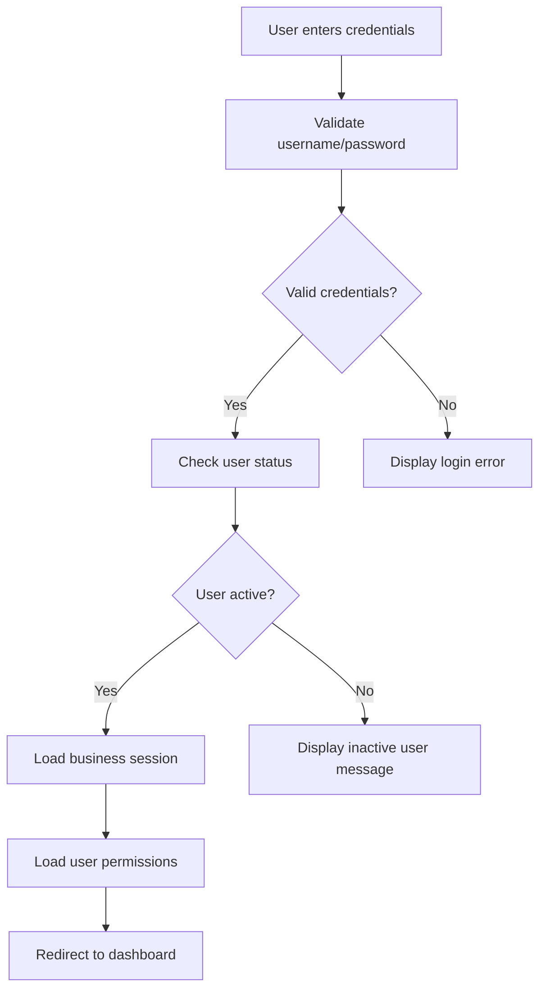
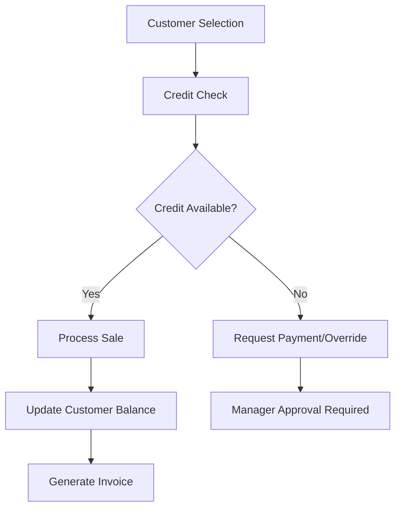
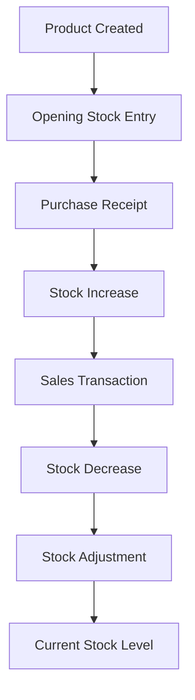
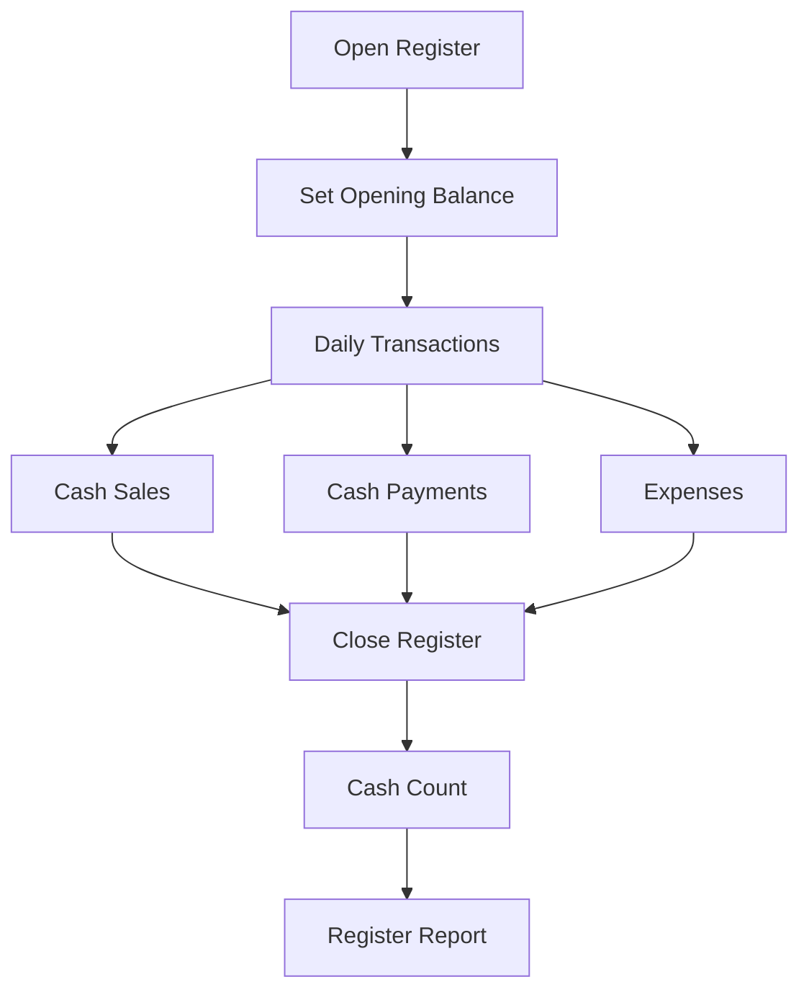

# POS System Functional Workflows & Feature Documentation

## Table of Contents
1. [User Management Workflow](#user-management-workflow)
2. [Contact Management System](#contact-management-system)
3. [Product Management Workflow](#product-management-workflow)
4. [Purchase Management Process](#purchase-management-process)
5. [Sales & POS Operations](#sales--pos-operations)
6. [Inventory Management](#inventory-management)
7. [Financial & Accounting Workflows](#financial--accounting-workflows)
8. [Reporting System](#reporting-system)
9. [Multi-Business Operations](#multi-business-operations)
10. [Advanced Features](#advanced-features)

---

## User Management Workflow

### 🔐 **Authentication & Access Control**

#### **Login Process Flow**


#### **User Creation Workflow**
**Path**: Users → Add User

**Step-by-Step Process**:
1. **Access Control Check**: Admin verifies `user.create` permission
2. **Business Subscription**: System checks subscription quota for users
3. **Form Validation**: 
   - Required fields: First name, role, email/mobile
   - Optional: Username (auto-generated if empty)
   - User permissions per business location
4. **Role Assignment**: Select from business-specific roles
5. **Location Permissions**: Assign accessible business locations
6. **Contact Access**: Set specific contact visibility (if enabled)
7. **Save & Notification**: Create user and trigger email notification

#### **Permission System Architecture**
```
Business Level
├── Admin (Full Access)
├── Manager (Location + Reports)
├── Cashier (POS + Basic Sales)
├── Inventory Manager (Products + Stock)
└── Custom Roles (Granular Permissions)
```

**Key Permission Categories**:
- **Product Management**: `product.view`, `product.create`, `product.update`, `product.delete`
- **Sales Operations**: `sell.view`, `sell.create`, `direct_sell.access`
- **Purchase Management**: `purchase.view`, `purchase.create`, `view_own_purchase`
- **Financial Access**: `account.access`, `view_cash_register`, `account_reports.view`
- **User Administration**: `user.view`, `user.create`, `roles.view`

### 👥 **User Types & Roles**

#### **1. Super Admin**
- **Scope**: Multi-business management
- **Capabilities**: Business creation, user impersonation, system settings
- **Access**: All businesses and locations

#### **2. Business Admin**
- **Scope**: Single business management
- **Capabilities**: User management, business settings, all operations
- **Restrictions**: Cannot change own role if only admin

#### **3. Location Managers**
- **Scope**: Specific business locations
- **Capabilities**: Location-specific operations, user management for location
- **Access**: Assigned locations only

#### **4. Sales Staff**
- **Scope**: POS and sales operations
- **Capabilities**: Create sales, process payments, basic inventory
- **Access**: Assigned locations and customer contacts

#### **5. Service Staff**
- **Scope**: Service operations (Restaurant module)
- **Capabilities**: Table management, order processing, service tracking
- **Additional**: Service staff PIN for quick login

---

## Contact Management System

### 👥 **Contact Types & Management**

#### **Contact Classification**
```
Contact Types:
├── Customer (Sales transactions)
├── Supplier (Purchase transactions)
└── Both (Dual-purpose contacts)
```

### **Customer Management Workflow**

#### **Customer Creation Process**
**Path**: Contacts → Customers → Add Customer

**Required Information**:
- **Basic Details**: Name (prefix + first + middle + last), mobile number
- **Business Info**: Customer group, contact ID (auto-generated)
- **Financial Settings**: Credit limit, payment terms, opening balance
- **Contact Details**: Email, alternate numbers, address
- **Custom Fields**: Business-specific custom data (10 fields)

#### **Customer Features**
1. **Credit Management**:
   - Set credit limits per customer
   - Track outstanding balances
   - Payment term enforcement (days/months)
   - Overdue notifications

2. **Customer Groups**:
   - Bulk pricing management
   - Discount percentage settings
   - Selling price group assignments
   - Group-based reporting

3. **Contact Access Control**:
   - Assign customers to specific users
   - Restrict visibility based on user permissions
   - Track customer creation and modifications

#### **Customer Transaction Flow**


### **Supplier Management Workflow**

#### **Supplier Creation Process**
**Path**: Contacts → Suppliers → Add Supplier

**Required Information**:
- **Business Details**: Supplier business name, contact person
- **Payment Terms**: Pay term number and type (days/months)
- **Tax Information**: Tax number, tax-exempt status
- **Banking Details**: Account information for payments

#### **Supplier Features**
1. **Purchase Management**:
   - Track purchase orders and receipts
   - Manage purchase returns
   - Payment due tracking

2. **Supplier Assessment**:
   - Purchase history analysis
   - Payment performance tracking
   - Stock report by supplier

3. **Multiple Locations**:
   - Supplier can serve multiple business locations
   - Location-specific pricing agreements

### **Contact Advanced Features**

#### **1. Ledger Management**
- **Complete Transaction History**: All sales, purchases, payments
- **Balance Calculations**: Real-time due amounts
- **Multiple Formats**: Standard, detailed, summary views
- **Export Options**: PDF, print-friendly formats

#### **2. Contact Communication**
- **Email Integration**: Send statements, notifications
- **SMS Notifications**: Payment reminders, promotions
- **Document Management**: Attach files, notes, contracts

#### **3. Import/Export System**
- **Bulk Import**: CSV format with 27 columns
- **Data Validation**: Contact ID uniqueness, required fields
- **Error Handling**: Row-by-row validation with error reporting

---

## Product Management Workflow

### 📦 **Product Hierarchy & Structure**

#### **Product Organization**
```
Product Structure:
├── Categories (Hierarchical)
│   ├── Main Category
│   └── Sub Category
├── Brands (Product grouping)
├── Units (Measurement)
└── Variations (Product options)
```

### **Product Creation Workflow**

#### **Basic Product Setup**
**Path**: Products → Add Product

**Step 1: Basic Information**
- **Product Name**: Primary identifier
- **Product Code/SKU**: Auto-generated or manual
- **Category & Sub-category**: Product classification
- **Brand**: Product manufacturer/brand
- **Unit**: Base measurement unit (pieces, kg, liters)

**Step 2: Product Type Selection**
1. **Single Product**: No variations
2. **Variable Product**: Multiple variations (size, color, etc.)
3. **Combo Product**: Bundle of multiple products

#### **Advanced Product Configuration**

**Step 3: Pricing & Tax**
- **Purchase Price**: Cost price from supplier
- **Selling Price**: Retail price or profit margin %
- **Tax Settings**: Tax rate application
- **Multiple Selling Prices**: Different prices for customer groups

**Step 4: Inventory Settings**
- **Track Quantity**: Enable/disable stock tracking
- **Alert Quantity**: Low stock notification threshold
- **Opening Stock**: Initial stock quantities per location

**Step 5: Product Details**
- **Product Description**: Detailed information
- **Product Images**: Multiple image uploads
- **Barcode**: Auto-generation or manual entry
- **Warranty**: Warranty period and terms

### **Product Variations System**

#### **Variable Product Management**
**Use Case**: Products with multiple options (size, color, model)

**Variation Template Creation**:
1. **Template Name**: Size, Color, Model, etc.
2. **Variation Values**: Small/Medium/Large, Red/Blue/Green
3. **Apply to Products**: Link template to products

**Individual Variation Setup**:
- **Unique SKU**: Auto-generated variation codes
- **Specific Pricing**: Price per variation
- **Stock per Location**: Separate inventory tracking
- **Variation Images**: Visual representation

#### **Combo Product Management**
**Purpose**: Sell multiple products as a single unit

**Setup Process**:
1. **Select Component Products**: Choose products to bundle
2. **Quantity per Component**: How many of each product
3. **Combo Pricing**: Bundle price vs individual prices
4. **Stock Management**: Automatic component stock deduction

### **Inventory Tracking System**

#### **Stock Movement Tracking**


#### **Multi-Location Inventory**
- **Location-Specific Stock**: Track inventory per business location
- **Stock Transfers**: Move inventory between locations
- **Location-Based Pricing**: Different prices per location

#### **Stock Alerts & Management**
- **Low Stock Alerts**: Automatic notifications when stock is low
- **Reorder Levels**: Set minimum stock levels
- **Stock Reports**: Current stock, valuation, movement reports

### **Product Import/Export System**

#### **Bulk Product Import**
**File Format**: Excel/CSV with specific column structure
**Supported Data**:
- Basic product information
- Pricing and tax settings
- Category and brand assignments
- Opening stock per location

**Validation Process**:
1. **File Structure Check**: Verify required columns
2. **Data Validation**: Check product codes, categories, units
3. **Error Reporting**: Line-by-line error details
4. **Batch Processing**: Import valid products, skip errors

---

## Purchase Management Process

### 🛒 **Purchase Order Workflow**

#### **Purchase Order Creation**
**Path**: Purchases → Add Purchase

**Step-by-Step Process**:

**Step 1: Purchase Header**
- **Supplier Selection**: Choose from supplier contact list
- **Location**: Select business location for delivery
- **Reference Number**: Auto-generated or manual
- **Purchase Date**: Transaction date
- **Payment Terms**: From supplier settings or custom

**Step 2: Product Selection**
- **Product Search**: Search by name, SKU, or barcode
- **Quantity Entry**: Purchase quantity
- **Purchase Price**: Unit cost from supplier
- **Tax Calculations**: Apply tax rates per product
- **Discount**: Line-level or invoice-level discounts

**Step 3: Additional Information**
- **Shipping Details**: Shipping costs and addresses
- **Payment Information**: Payment method and terms
- **Notes**: Additional purchase notes
- **Document Upload**: Attach purchase documents

#### **Purchase Order States**
```
Purchase Lifecycle:
├── Draft (Editable)
├── Ordered (Sent to supplier)
├── Received (Goods received)
├── Pending (Partially received)
└── Cancelled (Order cancelled)
```

### **Purchase Receipt Process**

#### **Goods Receipt Workflow**
**Purpose**: Record received goods and update inventory

**Process Steps**:
1. **Open Purchase Order**: Access pending orders
2. **Quantity Verification**: Confirm received quantities
3. **Quality Check**: Record damaged or defective items
4. **Stock Update**: Automatic inventory adjustment
5. **Cost Updates**: Update product costs if different
6. **Payment Recording**: Record payments made

#### **Purchase Return Management**
**Scenarios**: Damaged goods, wrong items, quality issues

**Return Process**:
1. **Return Authorization**: Create return document
2. **Product Selection**: Choose items to return
3. **Return Reason**: Document reason for return
4. **Stock Adjustment**: Reduce inventory accordingly
5. **Supplier Credit**: Record supplier credit notes

### **Purchase Approval Workflow**

#### **Multi-Level Approval System**
**Configuration**: Business-specific approval limits

**Approval Levels**:
- **User Level**: Maximum purchase amount per user
- **Manager Approval**: Required for high-value purchases
- **Admin Approval**: Required for major purchases

**Approval Process**:
1. **Purchase Creation**: User creates purchase order
2. **Amount Check**: System checks approval limits
3. **Notification**: Send approval request to manager
4. **Review Process**: Manager reviews and approves/rejects
5. **Order Processing**: Approved orders sent to supplier

### **Purchase Analytics & Reporting**

#### **Purchase Reports**
1. **Purchase Summary**: Total purchases by date/supplier
2. **Purchase Details**: Line-by-line purchase analysis
3. **Supplier Performance**: Payment history, delivery times
4. **Cost Analysis**: Product cost trends and variations
5. **Purchase Returns**: Return rates and reasons

#### **Supplier Management**
- **Supplier Scorecard**: Performance metrics tracking
- **Payment History**: Due dates, payment schedules
- **Product Sourcing**: Track which suppliers provide which products
- **Contract Management**: Supplier agreements and terms

---

## Sales & POS Operations

### 💰 **Point of Sale (POS) System**

#### **POS Interface Workflow**
**Path**: POS → New Sale

**Interface Layout**:
- **Left Panel**: Product search and categories
- **Center Panel**: Selected products cart
- **Right Panel**: Customer info and payment processing

#### **Sale Creation Process**

**Step 1: Customer Selection**
- **Walk-in Customer**: Default customer for cash sales
- **Existing Customer**: Search by name, mobile, or ID
- **New Customer**: Quick customer creation
- **Customer Details**: Credit limit check, outstanding balance

**Step 2: Product Addition**
- **Product Search**: Multiple search methods
  - **Barcode Scanner**: Scan product barcodes
  - **Product Browser**: Browse by category
  - **Quick Search**: Type product name/SKU
  - **Favorites**: Frequently sold products

**Step 3: Quantity & Pricing**
- **Quantity Entry**: Manual or barcode-based
- **Price Modification**: Discount permissions required
- **Tax Calculations**: Automatic tax application
- **Line-level Discounts**: Product-specific discounts

**Step 4: Payment Processing**
- **Payment Methods**: Cash, card, bank transfer, credit
- **Split Payments**: Multiple payment methods per sale
- **Change Calculation**: Automatic change computation
- **Receipt Generation**: Print or email receipts

#### **POS Features**

**Quick Sale Functions**:
- **Hold Sales**: Save incomplete sales for later
- **Suspend/Resume**: Temporary sale suspension
- **Product Returns**: Process returns and exchanges
- **Discount Application**: Manager approval for large discounts

**Customer Features**:
- **Credit Sales**: Sell on credit with terms
- **Customer Points**: Loyalty points accumulation
- **Payment History**: View customer payment history
- **Outstanding Balance**: Real-time balance checking

### **Sales Order Management**

#### **Sales Order Workflow**
**Purpose**: Quotes and future delivery sales

**Order Process**:
1. **Quote Creation**: Generate customer quotes
2. **Order Confirmation**: Convert quotes to orders
3. **Partial Deliveries**: Multiple shipments per order
4. **Order Fulfillment**: Complete order delivery
5. **Invoice Generation**: Final invoice creation

#### **Sales Types**
1. **Direct Sales**: Immediate payment and delivery
2. **Credit Sales**: Payment terms applied
3. **Quotations**: Price quotes for customers
4. **Sales Orders**: Future delivery orders
5. **Draft Sales**: Incomplete sales saved for later

### **Invoice & Receipt Management**

#### **Invoice Generation**
- **Multiple Formats**: Different layout options
- **Custom Fields**: Business-specific information
- **Logo & Branding**: Company logo and details
- **Terms & Conditions**: Payment terms and policies

#### **Receipt Printing**
- **Thermal Printers**: Small receipt format
- **Laser Printers**: Full-page invoices
- **Email Receipts**: Digital receipt delivery
- **SMS Notifications**: Sale confirmation messages

### **Sales Returns & Exchanges**

#### **Return Process**
**Path**: Sales → Returns → Add Return

**Return Types**:
1. **Full Return**: Complete sale reversal
2. **Partial Return**: Selected items only
3. **Exchange**: Replace with different products
4. **Store Credit**: Issue credit for future purchases

**Return Workflow**:
1. **Original Sale Lookup**: Find original transaction
2. **Return Authorization**: Manager approval if required
3. **Product Selection**: Choose items to return
4. **Return Reason**: Document return reason
5. **Stock Update**: Return items to inventory
6. **Refund Processing**: Process customer refund

---

## Inventory Management

### 📊 **Stock Tracking System**

#### **Real-Time Inventory**
- **Live Stock Updates**: Automatic stock adjustments with each transaction
- **Multi-Location Tracking**: Separate inventory per business location
- **Batch/Lot Tracking**: Track product batches for expiry and recall
- **Serial Number Tracking**: Individual item tracking for high-value products

#### **Stock Adjustment Process**
**Path**: Products → Stock Adjustments

**Adjustment Types**:
1. **Physical Count**: Reconcile actual vs system stock
2. **Damaged Goods**: Write-off damaged inventory
3. **Expired Products**: Remove expired items
4. **Theft/Loss**: Record inventory losses
5. **Transfer In/Out**: Inter-location transfers

**Adjustment Workflow**:
1. **Create Adjustment**: Select location and reason
2. **Product Selection**: Choose products to adjust
3. **Quantity Changes**: Enter actual quantities
4. **Cost Impact**: Calculate adjustment value
5. **Approval Process**: Manager approval for large adjustments
6. **Stock Update**: Apply changes to inventory

### **Stock Transfers**

#### **Inter-Location Transfer Process**
**Purpose**: Move inventory between business locations

**Transfer Workflow**:
1. **Transfer Request**: Source location initiates transfer
2. **Product Selection**: Choose products and quantities
3. **Transfer Authorization**: Manager approval if required
4. **Shipment Creation**: Generate transfer document
5. **Goods Transit**: Physical movement of goods
6. **Receipt Confirmation**: Destination location confirms receipt
7. **Stock Updates**: Automatic inventory adjustments

#### **Transfer States**
```
Transfer Lifecycle:
├── Pending (Awaiting approval)
├── In Transit (Goods shipped)
├── Received (Goods received)
└── Cancelled (Transfer cancelled)
```

### **Opening Stock Management**

#### **Initial Stock Setup**
**Path**: Products → Opening Stock

**Setup Process**:
1. **Location Selection**: Choose business location
2. **Product List**: Import or select products
3. **Quantity Entry**: Enter opening quantities
4. **Cost Values**: Set opening stock costs
5. **Date Setting**: Opening stock date
6. **Batch Processing**: Process all opening stock

#### **Opening Stock Import**
- **Excel Template**: Predefined format for bulk import
- **Data Validation**: Check product codes and locations
- **Error Handling**: Report and skip invalid entries
- **Batch Processing**: Import large quantities efficiently

---

## Financial & Accounting Workflows

### 💰 **Payment Processing System**

#### **Payment Methods Configuration**
- **Cash Payments**: Default payment method
- **Card Payments**: Credit/debit card processing
- **Bank Transfers**: Electronic fund transfers
- **Cheque Payments**: Check processing and tracking
- **Credit Terms**: Customer credit management
- **Digital Wallets**: Mobile payment integration

#### **Payment Recording Workflow**
**Path**: Various → Payment Entry

**Payment Types**:
1. **Sale Payments**: Customer payments for sales
2. **Purchase Payments**: Supplier payments for purchases
3. **Return Payments**: Refunds for returns
4. **Opening Balance**: Initial customer/supplier balances
5. **Advance Payments**: Pre-payments from customers

**Payment Process**:
1. **Transaction Selection**: Choose unpaid transactions
2. **Payment Amount**: Enter payment amount
3. **Payment Method**: Select payment type
4. **Reference Details**: Payment reference numbers
5. **Account Assignment**: Link to chart of accounts
6. **Receipt Generation**: Generate payment receipts

### **Cash Register Management**

#### **Cash Register Operations**
**Purpose**: Track daily cash transactions and balances

**Daily Operations**:
1. **Register Opening**: Set opening cash amount
2. **Sale Transactions**: Record cash sales
3. **Cash Payments**: Supplier payments in cash
4. **Expense Payments**: Business expense payments
5. **Register Closing**: Count and verify cash balance

#### **Cash Register Workflow**


### **Account Management**

#### **Chart of Accounts**
**Structure**: Hierarchical account organization
- **Assets**: Current assets, fixed assets
- **Liabilities**: Current liabilities, long-term debt
- **Equity**: Owner's equity, retained earnings
- **Income**: Sales revenue, other income
- **Expenses**: Operating expenses, cost of goods sold

#### **Account Transactions**
**Purpose**: Record all financial transactions

**Transaction Types**:
1. **Journal Entries**: Manual accounting entries
2. **Automatic Entries**: System-generated transactions
3. **Adjusting Entries**: Period-end adjustments
4. **Closing Entries**: Period closing transactions

---

## Reporting System

### 📈 **Sales Reports**

#### **Sales Summary Reports**
1. **Daily Sales**: Sales by date and location
2. **Sales by Customer**: Customer-wise sales analysis
3. **Sales by Product**: Product performance reports
4. **Sales by Staff**: Staff performance tracking
5. **Payment Method Reports**: Payment analysis

#### **Detailed Sales Reports**
- **Invoice Details**: Line-by-line sale analysis
- **Profit/Loss**: Gross profit and margin analysis
- **Tax Reports**: Tax collected and paid reports
- **Commission Reports**: Staff commission calculations

### **Purchase Reports**

#### **Purchase Analysis**
1. **Purchase Summary**: Supplier and date-wise purchases
2. **Purchase Details**: Product-wise purchase analysis
3. **Supplier Reports**: Supplier performance metrics
4. **Cost Analysis**: Product cost trend analysis

### **Inventory Reports**

#### **Stock Reports**
1. **Current Stock**: Real-time inventory levels
2. **Stock Valuation**: Inventory value reports
3. **Stock Movement**: Product movement history
4. **Low Stock Alert**: Products below reorder level
5. **Expiry Reports**: Products nearing expiry

#### **Advanced Inventory Reports**
- **ABC Analysis**: Product classification by value
- **Fast/Slow Moving**: Product velocity analysis
- **Dead Stock Report**: Non-moving inventory
- **Stock Age Analysis**: Inventory aging reports

### **Financial Reports**

#### **Standard Financial Reports**
1. **Profit & Loss**: Income statement
2. **Balance Sheet**: Financial position
3. **Cash Flow**: Cash movement analysis
4. **Trial Balance**: Account balance verification

#### **Management Reports**
- **Dashboard Analytics**: Key performance indicators
- **Trend Analysis**: Business performance trends
- **Comparative Reports**: Period-over-period analysis
- **Budget vs Actual**: Budget performance tracking

---

## Multi-Business Operations

### 🏢 **Business Management System**

#### **Multi-Tenant Architecture**
- **Business Isolation**: Complete data separation between businesses
- **Shared Users**: Users can access multiple businesses
- **Business Switching**: Easy switching between businesses
- **Centralized Administration**: Super admin oversight

#### **Business Setup Workflow**
**Path**: Super Admin → Businesses → Add Business

**Setup Process**:
1. **Business Information**: Name, logo, contact details
2. **Business Settings**: Currency, timezone, financial year
3. **Location Setup**: Business locations and addresses
4. **User Assignment**: Assign users to business
5. **Module Configuration**: Enable/disable business modules
6. **Initial Setup**: Opening balances and basic data

### **Location Management**

#### **Multi-Location Features**
- **Location-Specific Inventory**: Separate stock per location
- **Location-Based Pricing**: Different prices per location
- **Location Permissions**: User access control per location
- **Inter-Location Transfers**: Stock movement between locations

#### **Location Configuration**
1. **Location Details**: Name, address, contact information
2. **Location Settings**: Default customers, invoice schemes
3. **User Permissions**: Assign users to locations
4. **Printer Configuration**: Receipt printers per location

---

## Advanced Features

### 🔧 **System Configuration**

#### **Business Settings**
1. **General Settings**: Company info, currency, timezone
2. **Tax Settings**: Tax rates and calculations
3. **Payment Settings**: Payment methods configuration
4. **Invoice Settings**: Invoice layouts and numbering
5. **Notification Settings**: Email and SMS configuration

#### **Module Management**
**Available Modules**:
- **Restaurant**: Table management, kitchen orders
- **Manufacturing**: Production and assembly
- **Repair**: Service and repair tracking
- **CRM**: Customer relationship management
- **E-commerce**: Online store integration
- **Accounting**: Advanced accounting features

### **Integration Capabilities**

#### **E-commerce Integration**
- **WooCommerce Sync**: Product and order synchronization
- **API Endpoints**: RESTful API for third-party integration
- **Webhook Support**: Real-time data updates
- **Custom Fields**: Flexible data structure

#### **Payment Gateway Integration**
- **Stripe**: Credit card processing
- **PayPal**: Online payment processing
- **Razorpay**: Indian payment gateway
- **Local Gateways**: Country-specific payment options

### **Backup & Security**

#### **Data Backup System**
- **Automatic Backups**: Scheduled database backups
- **Manual Backups**: On-demand backup creation
- **Cloud Storage**: Integration with cloud storage services
- **Backup Restoration**: Easy restore functionality

#### **Security Features**
- **Role-Based Access**: Granular permission system
- **Activity Logging**: Complete audit trail
- **Data Encryption**: Sensitive data protection
- **Session Management**: Secure user sessions

---

## Conclusion

This comprehensive documentation covers all major functional workflows in the POS system. Each feature is designed to work together seamlessly, providing a complete business management solution for retail, restaurant, and service businesses.

The system's modular architecture allows businesses to enable only the features they need, while the multi-tenant design supports growth from single-location operations to complex multi-business enterprises.

For detailed technical implementation, refer to the Controllers Architecture and Database ERD documentation files.
